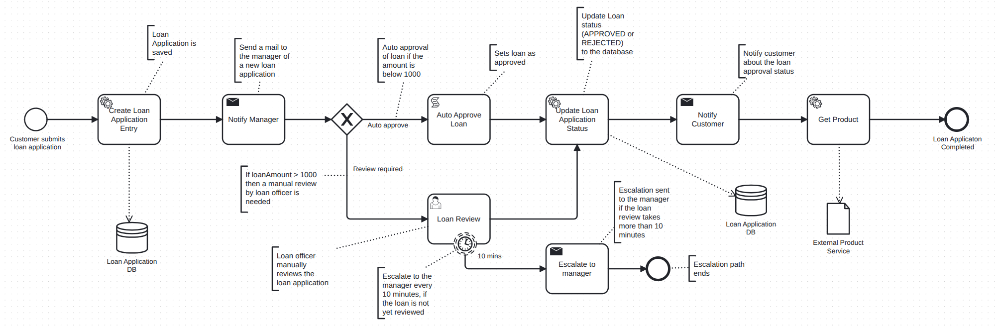

# Camunda Loan Application Process

## BPMN
[📄 Loan Application Process BPMN](src/main/resources/LoanApplicationProcess.bpmn)  
  

## Demo 
A short demo of the Loan Application process covering multiple scenarios.  
- [📥 Angular Forms](docs/Angular_Loan_Application_Process_Demo.mp4)
- [📥 Embedded Forms](docs/Loan_Application_Process_Demo.mp4)

### Scenarios Demonstrated
1. **Auto Approval** – Loan amount **<= 1000**  

2. **Loan Review** – Loan amount **> 1000**, **approved** with **manager escalation** every 1 minute (for demo) until review task is completed  

3. **Loan Review** – Loan amount **> 1000**, **rejected**  